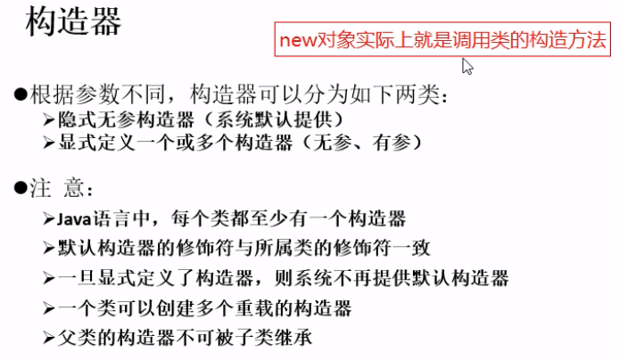
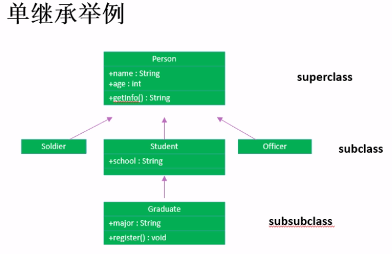

### 类的成员之三：构造器（构造方法）

- **构造器的特征** 
  - 它具有与类相同的名称
  - 它不声明返回值类型（与声明为void不同）
  - 不能被static、final、synchronized、abstract、native修饰，不能有return语句返回值。
- **构造器的作用：创建对象；给对象进行初始化**
  - 如：Order o = new Order(); Person p = new Person(Peter, 15);
  - 如同我们规定每个“人”一出生就必须先洗澡，我们就可以在“人”的构造方法中加入完成“洗澡”的程序代码，于是每个“人”一出生就会自动完成“洗澡”，程序就不必再在每个人刚出生时一个一个地告诉他们要“洗澡”了。
- new的构造方法：
 
--------
### this 关键字

- 在java中，this关键字比较难理解，它的作用和其词义很接近。
  - 它在方法内部使用，即这个方法所属对象的引用；
  - 它在构造器内部使用，表示该构造器正在初始化的对象。
- this表示当前对象，可以调用类的属性、方法和构造器。
- 什么时候使用this关键字呢？
  - 当在方法内需要用到调用该方法的对象时，就用this。

- **注意：** 
  - 使用this()必须放在构造器的首行！
  - 使用this()调用本类中其他的构造器，保证至少有一个构造器是不用this的。（实际上就是不能出现构造器自己调用自己）
  
### 面向对象特征之二：继承

- **为什么要有继承？** 
  - 多个类中存在相同属性和行为时，将这些内容抽取到单独一个类中，那么多个无需再定义这些属性和行为，只要继承那个类即可。
- 类继承语法规则：
  - class Subclass exetends Superclass{}

- 继承的作用：
  - 继承的出现提高了代码的复用性。
  - 继承的出现让类与类之间产生了关系，提供了多态的前提。
  - 不要仅为了获取其他类中某个功能而去继承，继承是要有逻辑关系在里面的，不要随意继承。
- 子类继承了父类，就继承了父类的方法和属性。
- 在子类中，可以使用父类中定义的方法和属性，也可以创建新的数据和方法。
- 在java中，继承的关键字用的是“extends”，即子类不是父类的子集，而是对父类的“扩展”。
- 子类不能直接访问父类中私有的（private）的成员变量和方法。
- java只支持单继承，不允许多重继承。
  - 一个子类只能有一个父类。
  - 一个父类可以派生出多个子类。
  --------

   
- 可以多层继承，不能多重继承。
