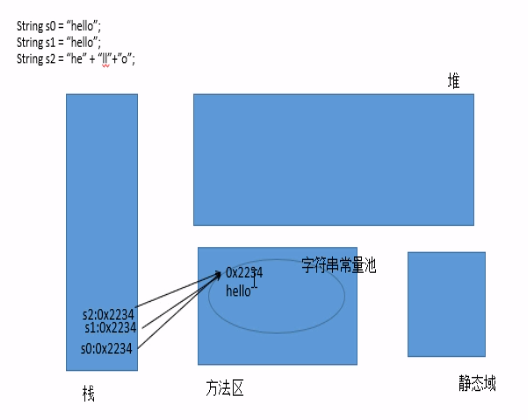

# java注释种类

1. 多行注释 
```
/*
这是一条
多行注释
*/
```
2. 单行注释
```
//这是一条单行注释
```
3. 文档注释
```
/**
*这是一条多行注释
*这是一条单行注释
*这是文档注释
*/
```
4.养成编写注释的编程习惯
# java命名规范
1. 包(package)：用于将完成不同功能的类分门别类，放在不同的目录(包)下，包的命名规则：将公司域名反转作为包名。比如 www.baidu.com 对于包名：每个字母都需要小写。比如：com.baidu.test;该包下的Test类的全名是：com.baidu.Test.java , xxxyyyzzz
 
如果定义类的时候没有使用package,那么java就认为我们所定义的类位于默认包里面(default package).
 
2. 类：首字母大写，如果一个类由多个单词构成，那么每个单词的首字母都大写，而且中间不使用任何的连接符。尽量使用英文。如ConnectionFactory, XxxYyyZzz
 
3. 方法：首单词全部小写，如果一个方法由多个单词构成，那么从第二个单词开始首字母大写，不使用连接符。addPerson, xxxYyyZzz
 
4. 属性：与方法相同。如ageOfPerson
 
5. 常量：所有单词的字母都是大写，如果有多个单词，那么使用下划线链接即可, XXX_YYY_ZZZ
# 标识符
1. 用户可以起名的地方都是标识符
2. 不能数字开头
3. 标识符不能包含空格
4. 起名时最好有意义
# 变量
1. 变量要初始化值
# 数据类型
在java中，数据类型分为基本数据类型和引用数据类型，其中基本数据类型有8种，除了8种基本数据类型之外的其他所有数据类型都是引用数据类型

| 数据类型 | 占用储存空间 | 范围                               |
|----------|--------------|------------------------------------|
| byte     | 1字节=8bit   | -128～127                          |
| short    | 2字节        | -2<sup>15</sup>～2<sup>15</sup>-1  |
| int      | 4字节        | -2<sup>31</sup> ～2<sup>31</sup>-1 |
| long     | 8字节        | -2<sup>63</sup> ～2<sup>63</sup>-1 |

**long类型特殊赋值方式** :long a = 2L，在数字后加L 
#### 浮点类型：float、double

| 类型         | 占用储存空间 | 范围                                | 精度         |
|--------------|--------------|-------------------------------------|--------------|
| 单精度float  | 4字节        | -2<sup>128</sup>～2<sup>128</sup>   | 7位有效数字  |
| 双精度double | 8字节        | -2<sup>1024</sup>～2<sup>1024</sup> | 16位有效数字 |

**float类型特殊赋值方式：** float a = 21F,在数字后加F
#### 布尔类型 boolean
例如： boolean b1 = true
boolean b2 = false
1. boolean类型适用于逻辑运算，一般用于程序流程控制：
* if条件语句；
* while循环语句；
* do-while循环语句；
* for循环语句；
#### 字符类型 char
例如： char c1 = 'a'
#### 引用类型
1. 引用类型都可以用null作为值，也就是说可以在初始化的时候赋值为null
2. String是引用类型，也就是说可以用null作为值
 
3. 两个相同字符串其实引用的是字符串常亮池中的相同字符串
- String i0 = "hello"
- String i1 = "hello"
+ 这种不会在内存中存在两个"hello",只存在一个"hello"
+ 假设"hello"的内存地址是XXXXXX，声明s0变量是给s0赋值“hello”的内存地址；当我们再声明s1也赋值“hello”的时候也是赋值实际内存中“hello”的地址。
4. String 声明的字符串可以多节拼接，例如：String st= "hah" + "nihao"
