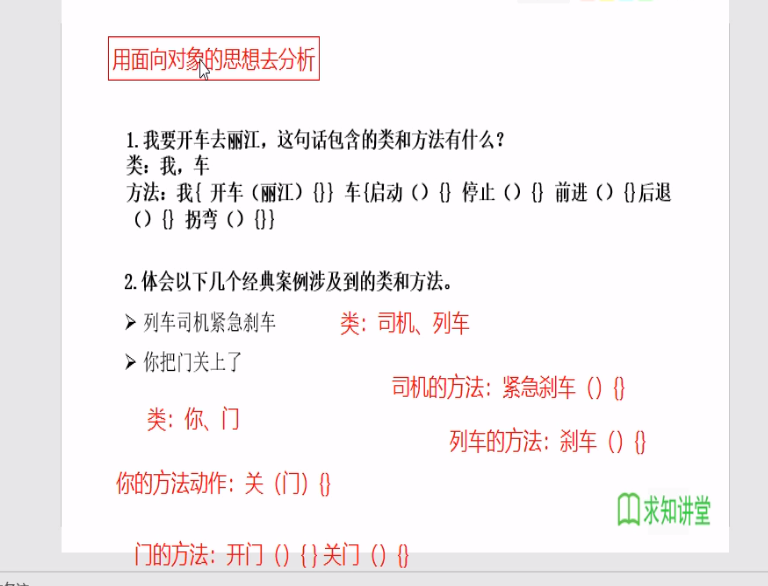

### 面向对象
* **面向对象(oop)与面向过程(pop)**
  * 两者都是一种思想，面向对象是相对于面向过程而言的。面向过程，强调的是功能行为。面向对象，将功能封装进对象，强调了具备了功能的对象。
  * 面向对象更加强调运用人类的日常的思维逻辑采用的思想方法与原则，如抽象、分类、继承、聚合、多态等。
* **面向对象的三大特征**
  * 封装(Encapsulation)
  * 继承(Inheritance)
  * 多态(Polymorphism)
### java类及类的成员
* 现实世界万事万物是友分子、原子构成的。同理，java代码世界是由诸多个不同功能的类构成的。
* 万物皆对象，可以用java语言来描述万事万物，把万事万物抽象成一个个的class类。
* 现实世界中的分子、原子又是由什么构成的呢？原子核、电子！那么，java中用类class来描述事物也是如此
  * **属性：** 对应类中的成员变量
  * **行为：** 对应类中的成员方法
 
```java
    /**
    *人
    */
public class Person{
    //属性，成员变量，类的成员变量可以先声明，不用初始化，类成员变量是有默认值
    String name; //姓名，String的默认值是null
    int age; //年龄， int 的默认值是0

    //行为，方法，也叫函数
    /*
    * 打印姓名
    */
    public void showName(){//方法的名称如果是多个单词，首个的单词的首字母小写，其他的单词字母大写，驼峰命名法
    System.out.println("姓名"+ name);
    }
    /**
    *获取年龄
    */
    public int getAge(){//如果是一个有返回值的方法，那么方法的最后一行一定是返回相应的数据，使用return关键字
    return age;
    }

}
```

#### 创建java自定义类
**步骤:** 
1. 自定义类（考虑修饰符、类名）
2. 编写类的属性（考虑修饰符、属性类型、属性名、初始化值）
3. 编写类的方法（考虑修饰符、返回值类型、方法名、形参等）
