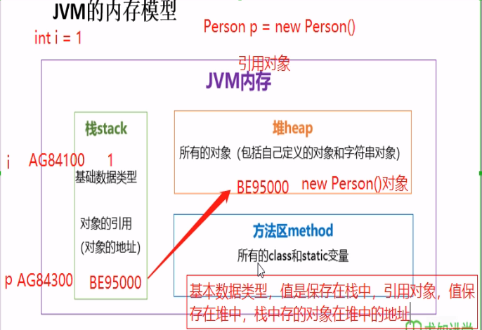
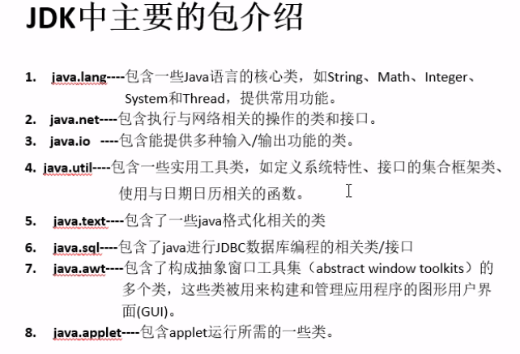

### 可变个数的形参

```java
//数组来定义方法
public static void tset (int a, String[] books);
//可变个数形参来定义方法
public static void test (int a, String...books);
```

**说明：** 
1. 可变参数： 方法参数部分制定类型的参数个数是可变多个
2. 声明方式：方法名（参数的类型名...参数名）
3. 可变参数方法的使用与方法参数部分使用数组是一致的
4. 方法的参数部分有可变形参，需要放在形参声明的最后

### 方法的参数传递

- 方法，必须有起所在类或对象调用才有意义。若方法含有参数：
  - 形参：方法声明时的参数。
  - 实参：方法调用是实际传递给形参的参数值
- java的实参值如何传入方法呢？
  - **java里方法的参数传递方式只有一种：值传递**。即将实际参数值的副本（复制品）传入方法内，而参数本身不受影响。

  --------
   

  --------
### 包的概念(package)

1.import 调用其他包中的方法 

- 包通常用小写单词，类名首字母通常大写。
 
### 面向对象特征之一：封装和隐藏

1. java中通过将数据声明为私有的（private），再提供公共的（public）方法：getXxx()和setXxx()实现对该属性的操作，以实现下述目的：
  - 隐藏一个类中不需要对外提供的实现细节。
  - 使用者只能通过事先定制好的方法来访问数据，可以方便地加入控制逻辑，限制对属性的不合理操作。
  - 便与修改，增强代码的可维护性。

- getXxx:读取，setXxx:写入

### 四种访问权限修饰符

- java权限修饰符public、protected、private置于类的成员定义前，用来限定对象对该类成员的访问权限。

|   修饰符  | 类内部 | 同一个包 | 子类 | 任何地方 |
|:---------:|:------:|:--------:|:----:|:--------:|
|  private  |   yes  |          |      |          |
|  （缺省） |   yes  |    yes   |      |          |
| protected |   yes  |    yes   |  yes |          |
|   public  |   yes  |    yes   |  yes |    yes   |

- 对于class的权限修饰只可以用public和default（缺省）
- 在同一个java文件中可以写多个class，但是只有一个public的class，其他的class只能缺省。
